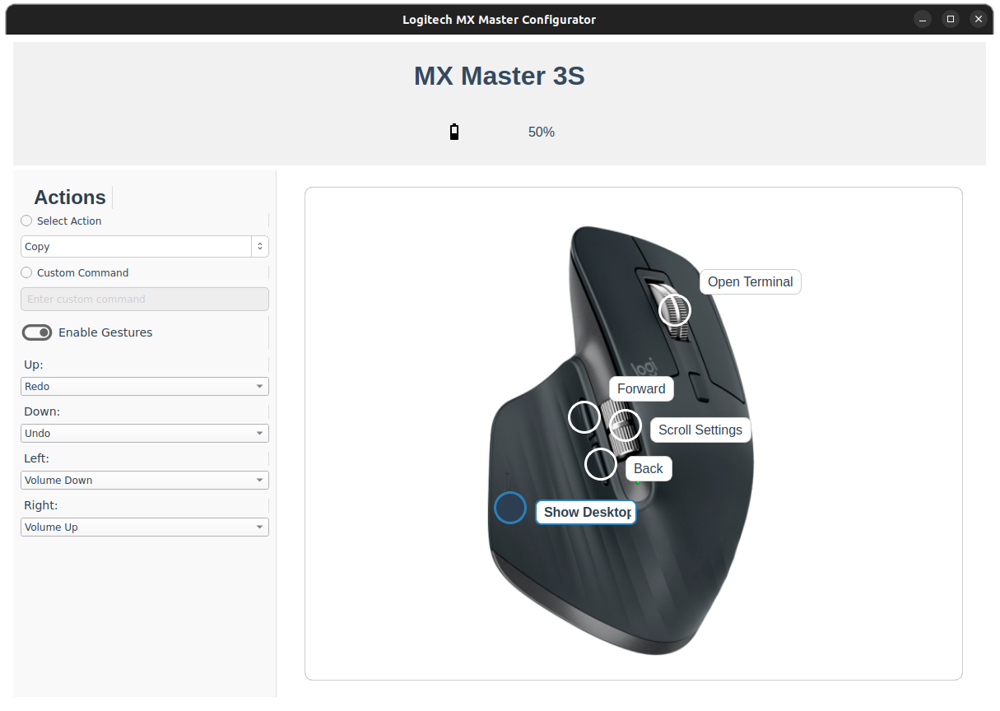

# MXMouse

MXMouse is a Python-based application designed to emulate the functionality of the official LogiOps software for Logitech MX Master 3 and 3S mice. It offers a simple and intuitive graphical interface, allowing users to customize their mouse buttons and gestures with ease.



## Table of Contents

- [Introduction](#introduction)
- [Installation](#installation)
- [How It Works](#how-it-works)
- [Compiling](#compiling)
- [License](#license)

## Introduction

MXMouse aims to provide a seamless experience for Logitech MX Master 3 and 3S mouse users by replicating the capabilities of LogiOps. With its user-friendly graphical interface, MXMouse allows you to:

- **Customize Button Actions:** Assign predefined actions or custom commands to your mouse buttons.
- **Configure Gestures:** Set up gestures for enhanced productivity and navigation.
- **Adjust Scroll Settings:** Modify scroll sensitivity and invert scroll directions to suit your preferences.

Whether you're a developer, designer, or everyday user, MXMouse offers the flexibility to tailor your mouse functionality to your specific needs.

## Installation

### 1. Install via .deb Package

Download the latest MXMouse Debian package from the **dist** folder below:

- [mxmouse.deb](dist/mxmouse.deb)

Once downloaded, open a terminal in the folder where the package is located and run:

```bash
sudo apt install ./mxmouse.deb
```

### 2. Use the Standalone Executable

If you prefer, you can also use the standalone executable:
- [mxmouse](dist/mxmouse)
Run it from a terminal:
```bash
./mxmouse
```

## How It Works

MXMouse's functionality is primarily driven by the `backend.py` file, which handles input event capturing and action execution. Here's an overview of its core components:

### 1. Action Execution

The `ActionExecutor` class is responsible for executing actions based on user configurations. It supports:

- **Predefined Actions:** Such as copying, pasting, adjusting volume, scrolling, and navigating forward/backward.
- **Custom Commands:** Users can define their own shell commands to be executed on specific mouse events.

```python
class ActionExecutor:
    def execute(self, action):
        if isinstance(action, dict):
            return
        elif action.startswith("Command:"):
            command = action.split("Command:")[1].strip()
            subprocess.Popen(command, shell=True)
        else:
            predefined_actions = {
                "Copy": "xdotool key ctrl+c",
                "Paste": "xdotool key ctrl+v",
                "Volume Up": "xdotool key XF86AudioRaiseVolume",
                "Volume Down": "xdotool key XF86AudioLowerVolume",
                "Mute": "xdotool key XF86AudioMute",
                "Undo": "xdotool key ctrl+z",
                "Redo": "xdotool key ctrl+shift+z",
                "Scroll Up": "xdotool click 4",
                "Scroll Down": "xdotool click 5",
                "Scroll Left": "xdotool click 6",
                "Scroll Right": "xdotool click 7",
                "Left Click": "xdotool click 1",
                "Right Click": "xdotool click 3",
                "Forward": "xdotool key XF86Forward",
                "Back": "xdotool key XF86Back",
                "Open Terminal": "gnome-terminal",
                "Show Desktop": "xdotool key super+d",
                "Close Window": "xdotool key ctrl+w",
            }
            cmd = predefined_actions.get(action)
            if cmd:
                subprocess.Popen(cmd, shell=True)
            else:
                print(f"Acción predefinida desconocida: {action}")
```
### 2. Event Listening

The `MouseEventListener` class captures mouse events using the `evdev` library. It monitors button presses, releases, and gestures to trigger corresponding actions.

- **Button Mapping:** Associates mouse buttons with specific actions or disables default behaviors when custom actions are assigned.
- **Gesture Detection:** Recognizes directional gestures (up, down, left, right) when certain buttons are pressed and performs the configured actions.

```python
class MouseEventListener(threading.Thread):
    def __init__(self, config_manager, action_executor):
        super().__init__()
        self.config_manager = config_manager
        self.action_executor = action_executor
        self.running = True

        self.device = self.find_mouse_device()
        self.xinput_id = self.find_xinput_id("MX Master 3S")
        self.master_pointer_id = self.find_master_pointer_id()

        self.button1_pressed = False
        self.button1_gesture_detected = False
        self.button1_movement = {'x': 0, 'y': 0}
        self.gesture_threshold = 50
        self.cursor_position = (0, 0)

        self.original_button_map = self.get_xinput_button_map()
        if self.xinput_id and self.original_button_map:
            self.adjust_xinput_mappings()

    def run(self):
        for event in self.device.read_loop():
            if not self.running:
                break

            if event.type == ecodes.EV_KEY:
                key_event = categorize(event)
                button = self.map_code_to_button(key_event.scancode)
                if button == "Button 1":
                    if key_event.keystate == key_event.key_down:
                        self.handle_button1_press()
                    elif key_event.keystate == key_event.key_up:
                        self.handle_button1_release()
                elif button and button != "Button 5":
                    if key_event.keystate == key_event.key_down:
                        action = self.config_manager.get_action(button)
                        if action:
                            self.action_executor.execute(action)
            elif event.type == ecodes.EV_REL:
                if event.code == ecodes.REL_HWHEEL:
                    self.handle_hwheel(event.value)
                elif event.code == ecodes.REL_HWHEEL_HI_RES:
                    self.handle_hwheel_hi_res(event.value)
                elif event.code in [ecodes.REL_X, ecodes.REL_Y]:
                    self.handle_mouse_move(event)
```
### 3. Customization and Extensibility
MXMouse is designed to be adaptable:

- **Configuration Manager:** Manages user-defined settings and actions, allowing for persistent customization across sessions.
- **Input Mapping:** By modifying the `BUTTON_XINPUT_MAP` and related input handling logic, MXMouse can be adapted to work with various mice or input devices beyond the Logitech MX Master series.
```python
BUTTON_XINPUT_MAP = {
    "Button 1": 1,
    "Button 2": 8,
    "Button 3": 9,
    "Button 4": 4,
    "Button 5": 5,
    "ScrollLeft": 6,
    "ScrollRight": 7,
}
```
### 4. User Interface

The `gui.py` file provides a graphical interface using PyQt5, enabling users to:

- **Select and assign actions** to mouse buttons.
- **Enable and configure gestures** with both predefined actions and custom commands.
- **Adjust scroll settings**, including sensitivity and direction inversion.
- **Save and load configurations** to ensure persistent settings across sessions.

The UI consists of:

- **A main panel** displaying a graphical representation of the mouse.
- **A sidebar** for selecting buttons and assigning actions.
- **A gesture section** for configuring directional gestures when holding a specific button.
- **Scroll and sensitivity controls** for fine-tuning the mouse experience.

### 5. Compiling

To create a standalone executable, you can use PyInstaller:

```bash
pyinstaller --name mxmouse --onefile --windowed --add-data "assets/*:assets" src/main.py
```
### Explanation:

- `--name mxmouse`: Sets the executable name.
- `--onefile`: Packages everything into a single file.
- `--windowed`: Runs the program without opening a terminal.
- `--add-data "actions.json:."`: Includes `actions.json` in the compiled binary.
- `--add-data "assets/*:assets"`: Includes all asset files.
- `src/main.py`: Specifies the main script to run.

Ensure that you have **PyInstaller** installed before running the command:

```bash
pip install pyinstaller
```